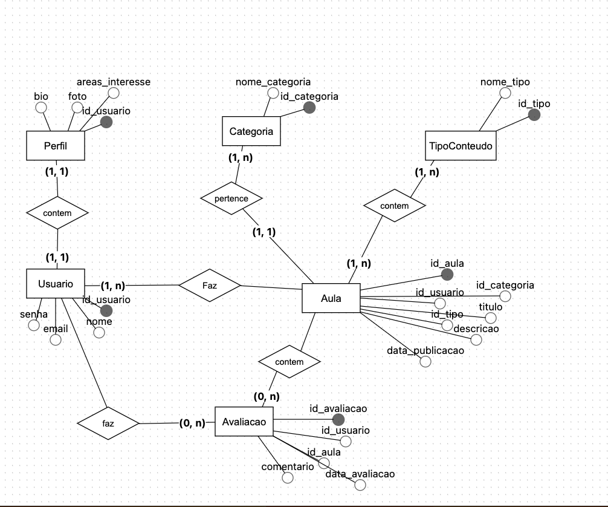

# 4. Projeto da Solução

<span style="color:red">Pré-requisitos: <a href="03-Modelagem do Processo de Negocio.md"> Modelagem do Processo de Negocio</a></span>

---
**ARQUITETURA DO SOFTWARE**
## 4.1. Arquitetura da Solução

A arquitetura da solução é fundamentada em um modelo de duas camadas principais: a camada de frontend, que será hospedada na Vercel devido à sua excelente compatibilidade com a tecnologia adotada e aos generosos limites de seu plano de hospedagem, e a camada de backend, hospedada no Microsoft Azure, aproveitando a compatibilidade com a tecnologia utilizada e a parceria estratégica com a instituição de ensino. A tecnologia escolhida para o frontend é o React, enquanto o backend será desenvolvido em .NET Core. A comunicação entre as camadas será realizada por meio de requisições HTTPS, com o frontend consumindo a API exposta pelo backend. Para a segurança e controle de acesso, será implementado um sistema de autenticação baseado em JWT (JSON Web Tokens), no qual o token será armazenado de forma segura nos cookies do navegador e enviado a cada requisição para validação no backend.

**Diagrama de Arquitetura:**
 
 


 
---
**MODELAGEM VISUAL DAS TELAS**

## 4.2. Wireframe / Mockup

Wireframe e Mockup são representações visuais das telas de um sistema **antes** do desenvolvimento do código.  
Eles ajudam a planejar, comunicar ideias e validar a interface com antecedência.

### Finalidade
- **Planejamento da interface** → organizar elementos (botões, menus, campos, imagens) e definir a estrutura de navegação.  
- **Comunicação da ideia** → facilitar o diálogo entre desenvolvedores, designers, clientes e usuários.  
- **Validação antecipada** → coletar feedback antes de investir tempo e recursos na programação.  
- **Guia para desenvolvimento** → servir como referência visual durante a implementação.

💡 **_Diferença:_**
- **Wireframe** → simples, sem cores ou imagens detalhadas; foca na estrutura e posicionamento.  
- **Mockup** → mais próximo do visual final, com cores, fontes e imagens, mas sem interatividade completa.

**Wireframe 1 — Tela Welcome** 


**Wireframe 2 — Tela de Login**  


**Wireframe 3 — Tela Cadastro**  


**Wireframe 4 — Tela Principal**  


**Wireframe 5 — Tela Video_1** 


**Wireframe 6 — Tela Video_2** 


**Wireframe 7 — Tela Pergunta_1** 


**Wireframe 8 — Tela Pergunta_2** 


**Wireframe 9 — Tela Perfil** 


---
**UML**

## 4.3 Diagrama de Classes

O diagrama de classes ilustra graficamente como será a estrutura do software, e como cada uma das classes da sua estrutura estarão interligadas. Essas classes servem de modelo para materializar os objetos que executarão na memória.

As referências abaixo irão auxiliá-lo na geração do artefato “Diagrama de Classes”.

> - [Diagramas de Classes - Documentação da IBM](https://www.ibm.com/docs/pt-br/rational-soft-arch/9.6.1?topic=diagrams-class)
> - [O que é um diagrama de classe UML? | Lucidchart](https://www.lucidchart.com/pages/pt/o-que-e-diagrama-de-classe-uml)


Código:

@startuml Diagrama_de_Classes

' Definição das Classes (Baseadas nas Tabelas)

class Usuario {
  - idUsuario: INT
  - nome: VARCHAR(100)
  - email: VARCHAR(100)
  - senha: VARCHAR(255)
  - fotoPerfil: VARCHAR(255)
  - tipoUsuario: ENUM(...)
  - classificacao: DECIMAL(3,2)
  - bio: TEXT
  - dataCadastro: TIMESTAMP
  - ativo: TINYINT(1)
  - emailVerificado: TINYINT(1)
  - ultimoAcesso: TIMESTAMP
  -- Métodos --
  + cadastrarUsuario()
  + fazerLogin(email, senha)
  + atualizarPerfil()
}

class AreaInteresse {
  - idArea: INT
  - nomeArea: VARCHAR(100)
  - descricao: TEXT
  - corHex: VARCHAR(7)
  - ativo: TINYINT(1)
  - dataCriacao: TIMESTAMP
  -- Métodos --
  + criarArea()
  + consultarConteudos(idArea)
}

class Conteudo {
  - idConteudo: INT
  - titulo: VARCHAR(150)
  - descricao: TEXT
  - tipo: ENUM(...)
  - urlVideo: VARCHAR(255)
  - duracao: INT
  - dataPublicacao: TIMESTAMP
  - publico: TINYINT(1)
  - ativo: TINYINT(1)
  - visualizacoes: INT
  -- Métodos --
  + publicar()
  + editar()
}

class Comentario {
  - idComentario: INT
  - texto: TEXT
  - dataComentario: TIMESTAMP
  - ativo: TINYINT(1)
  -- Métodos --
  + comentar(idConteudo)
  + excluir()
}

class Visualizacao {
  - idVisualizacao: INT
  - tempoAssistido: INT
  - dataVisualizacao: TIMESTAMP
  - concluido: TINYINT(1)
  -- Métodos --
  + registrarTempo(idConteudo, idUsuario, tempo)
}

class Interacao {
  - idInteracao: INT
  - tipoInteracao: ENUM(...)
  - dataInteracao: TIMESTAMP
  -- Métodos --
  + registrarInteracao(tipo)
}

class Recomendacao {
  - idRecomendacao: INT
  - prioridade: DECIMAL(5,2)
  - dataRecomendacao: TIMESTAMP
  - visualizada: TINYINT(1)
  -- Métodos --
  + gerarRecomendacao()
  + marcarComoVisualizada()
}

class PreferenciaUsuario {
  - idPreferencia: INT
  - tipoConteudoPreferido: ENUM(...)
  - dataPreferencia: TIMESTAMP
  - nivelInteresse: ENUM(...)
  -- Métodos --
  + definirPreferencia(tipo, nivel)
}

class UsuarioAreaInteresse {
  - idUsuarioArea: INT
  - dataAssociacao: TIMESTAMP
  -- Métodos --
  + associarArea()
  + desassociarArea()
}

class RecuperacaoSenha {
  - idRecuperacao: INT
  - token: VARCHAR(100)
  - dataSolicitacao: TIMESTAMP
  - dataExpiracao: TIMESTAMP
  - utilizado: TINYINT(1)
  -- Métodos --
  + solicitarToken()
  + validarToken(token)
}

' Relacionamentos (Associações baseadas em Chaves Estrangeiras)

' USUARIO com CONTEUDO (1:N - Usuário publica Conteúdo)
Usuario "1" -- "0..*" Conteudo : publica/é publicado por

' USUARIO com PREFERENCIA_USUARIO (1:N)
Usuario "1" -- "0..*" PreferenciaUsuario : define

' USUARIO com COMENTARIO (1:N)
Usuario "1" -- "0..*" Comentario : faz

' USUARIO com VISUALIZACAO (1:N)
Usuario "1" -- "0..*" Visualizacao : registra

' USUARIO com INTERACAO (1:N)
Usuario "1" -- "0..*" Interacao : realiza

' USUARIO com RECOMENDACAO (1:N)
Usuario "1" -- "0..*" Recomendacao : recebe

' USUARIO com RECUPERACAO_SENHA (1:N)
Usuario "1" -- "0..*" RecuperacaoSenha : solicita

' USUARIO com AREA_INTERESSE (N:M - Tabela Associativa)
Usuario "1" -- "0..*" UsuarioAreaInteresse
AreaInteresse "1" -- "0..*" UsuarioAreaInteresse
UsuarioAreaInteresse "1" *-- "1" Usuario : idUsuario
UsuarioAreaInteresse "1" *-- "1" AreaInteresse : idArea


' CONTEUDO com AREA_INTERESSE (1:N - Conteúdo pertence a uma Área)
AreaInteresse "1" -- "0..*" Conteudo : pertence a/tem

' CONTEUDO com COMENTARIO (1:N)
Conteudo "1" -- "0..*" Comentario : tem

' CONTEUDO com VISUALIZACAO (1:N)
Conteudo "1" -- "0..*" Visualizacao : registra

' CONTEUDO com INTERACAO (1:N)
Conteudo "1" -- "0..*" Interacao : relaciona-se com

' CONTEUDO com RECOMENDACAO (1:N)
Conteudo "1" -- "0..*" Recomendacao : é

' PREFERENCIA_USUARIO com AREA_INTERESSE (1:N - Preferência para uma Área)
AreaInteresse "1" -- "0..*" PreferenciaUsuario : se refere a

@enduml
---

**BANCO DE DADOS**

## 4.4. Modelo de Dados

A solução proposta exige um banco de dados capaz de armazenar e relacionar as informações necessárias para os processos mapeados, garantindo integridade e controle de acesso por perfil de usuário.

O desenvolvimento deve seguir **três etapas**:

---

### 4.4.1 Diagrama Entidade-Relacionamento (DER)




📌 **Entrega:** gere o diagrama no BR Modelo, exporte em **.png** e inclua-o nesta seção.


---

### 4.4.2 Esquema Relacional


### 4.4.3 Modelo Físico

O **Modelo Físico** é o script SQL que cria as tabelas no banco de dados.  
Este script pode ser gerado automaticamente no MySQL Workbench a partir do esquema relacional.

**Exemplo:**
```sql
CREATE TABLE Medico (
    MedCodigo INT PRIMARY KEY,
    MedNome VARCHAR(100) NOT NULL
);

CREATE TABLE Paciente (
    PacCodigo INT PRIMARY KEY,
    PacNome VARCHAR(100) NOT NULL
);

CREATE TABLE Consulta (
    ConCodigo INT PRIMARY KEY,
    MedCodigo INT,
    PacCodigo INT,
    Data DATE,
    FOREIGN KEY (MedCodigo) REFERENCES Medico(MedCodigo),
    FOREIGN KEY (PacCodigo) REFERENCES Paciente(PacCodigo)
);

CREATE TABLE Medicamento (
    MdcCodigo INT PRIMARY KEY,
    MdcNome VARCHAR(100) NOT NULL
);

CREATE TABLE Prescricao (
    ConCodigo INT,
    MdcCodigo INT,
    Posologia VARCHAR(200),
    PRIMARY KEY (ConCodigo, MdcCodigo),
    FOREIGN KEY (ConCodigo) REFERENCES Consulta(ConCodigo),
    FOREIGN KEY (MdcCodigo) REFERENCES Medicamento(MdcCodigo)
);
```
## 📌ATENÇÃO: salvar como banco.sql na pasta src/bd

---
### 4.4.4 Banco de Dados NoSQL (Opcional)

> **Atenção:** Preencha esta seção **somente se o seu projeto utilizar Banco de Dados NoSQL**.

Se o projeto adotar NoSQL, a entrega deve incluir:

#### 1. Modelo de Coleções / Documentos
- Descreva como os dados serão organizados em **coleções, documentos ou grafos**.  

#### 2. Exemplos de Documentos / Registros
- Mostre exemplos reais de dados para cada coleção ou entidade.  

```json
{
  "_id": "1",
  "nome": "Juliana",
  "email": "juliana@email.com",
  "perfil": "admin"
}
```
📌 **Entrega:** Inclua aqui os scripts utilizados para criar coleções e inserir dados.
